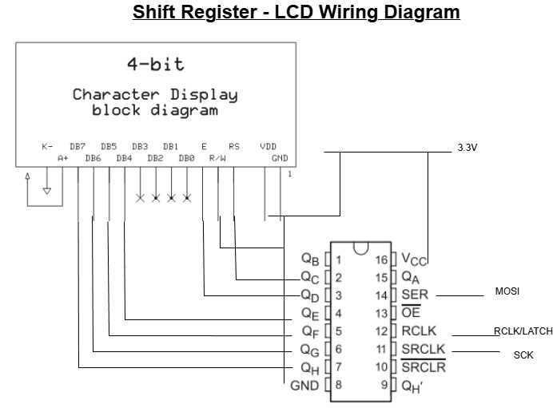

# ECEN-5813-Final_Project_mu2d2

Automatic plant watering system using an STM32F091RC microcontroller. The system monitors soil moisture via an ADC resistive sensor and controls a servo-actuated water valve based on moisture thresholds.

## Documentation & Media

The **Images_Videos** folder contains photos and videos documenting various stages of implementation, including:
- Assembly and component integration photos
- Sensor calibration and testing procedures
- Servo valve actuation tests
- LCD display output verification
- Final system demonstration video showing the complete watering cycle in operation

Refer to these media files for visual reference during hardware setup and debugging.

## Scope & Limitations

Due to time, complexity, and debugging constraints, the following items were eliminated from the project scope:

**Mechanical Design (Servo Forward):** The mechanical design from the servo actuator forward (valve linkage, plumbing integration, enclosure) remains incomplete. The software successfully demonstrates servo control and angle ramping, but final mechanical implementation for field deployment was deferred. Manual watering was used instead when servo moved to open and closed angles to imitate mechanical design.

**FreeRTOS Scheduling:** Real-time operating system integration was initially considered but removed from scope. The current implementation uses a cooperative bare-metal state machine with non-blocking polling, which provides sufficient responsiveness for the watering application while maintaining simplicity and predictability for debugging.

These trade-offs prioritized core sensor integration, display output, and robust state management over advanced scheduling and mechanical packaging.

## Overview

**Target Hardware:**
- **MCU**: STM32F091RC (Cortex-M0, 48 MHz)
- **Build Tool**: STM32CubeIDE with GNU Make
- **Serial Output**: 9600 baud (8-N-1) for debug logging

**Soil Moisture Sensor:**
- Analog Resistive soil moisture detection
- 5V Input, 0-4.2V analog output
- Datasheet & Order Link: https://www.digikey.com/en/products/detail/dfrobot/SEN0114/6588525
    - https://mm.digikey.com/Volume0/opasdata/d220001/medias/docus/2280/SEN0114_Web.pdf
- Calibrate Sensor values to your use case

**Digital Servo:**
- Datasheet & Order Link: https://www.amazon.com/Miuzei-Torque-Digital-Waterproof-Control/dp/B07HNTKSZT
    - https://images-na.ssl-images-amazon.com/images/I/81Lbgu+nG6L.pdf
- 20Kg torque, 5V DC servo 
- 0 - 270 degree range

**Shift Register (74HC595):**
- Datasheet & Order Link: https://www.ti.com/product/SN74HC595
    - https://www.ti.com/lit/ds/symlink/sn74hc595.pdf
- 8-bit serial-in, parallel-out shift register
- 5V or 3.3V operation (verify logic levels with LCD)
- Expands MCU I/O: 3 SPI pins (MOSI, SCK, RCLK) drive 8 parallel outputs to LCD control/data lines

**LCD Screen (HD44780-compatible):**
- Datasheet & Order Link: https://newhavendisplay.com/content/specs/NHD-0216HZ-FSW-FBW-33V3C.pdf
- 16x2 character LCD display (typical)
- HD44780 controller, 4-bit or 8-bit interface mode
- 5V or 3.3V operation (verify voltage compatibility with 74HC595 and MCU)
- Operated in 4-bit mode: DB4..DB7 for data, RS for register select, E for enable 

**Key Features:**
- Non-blocking soil moisture measurement with power-gating to reduce sensor corrosion
- Servo-controlled water valve with smooth angle ramping
- State machine-based watering logic with thresholds for dry/wet detection
- Comprehensive unit tests with error sentinel handling
- ADC timeout protection and sensor health checks

## Code Structure

### Module Interactions Diagram

```
main.c (Application Entry)
    ├── init_uled() / set_uled()           [pwm.c]        (Heartbeat LED)
    ├── init_PWM_SERVO()                   [pwm.c]        (Servo PWM init)
    ├── init_systick()                     [timers.c]     (Millisecond tick)
    ├── lcd_init()                         [lcd.c]        (LCD init via spi/74HC595)
    ├── soil_sensor_init()                 [soil_sensor.c]
    │   ├── init_ADC()                     [adc.c]        (ADC peripheral init)
    │   └── init_soil_sensor_power()       [soil_sensor.c](GPIO for power control)
    │
    └── Main Loop:
        ├── soil_measure_fsm()              [soil_sensor.c]
        │   ├── adc_manual_sample()         [adc.c]       (Read ADC with timeout)
        │   └── soil_raw_to_pct()           [soil_sensor.c](Convert to %)
        │
        ├── water_fsm_run()                 [state_machine.c]
        │   ├── soil_sensor_get_raw()       [soil_sensor.c](Query measurement)
        │   ├── servo_set_angle()           [pwm.c]       (Actuate valve)
        │   ├── lcd_printf()                [lcd.c]       (Display level/raw)
        │   └── LOG()                       [log.h]       (Debug output)
        │
        └── heartbeat_led()                 [main.c]      (Blink indicator)
```

### Module Descriptions

#### **adc.c / adc.h**
**Purpose**: STM32F091 ADC peripheral control with timeouts and error handling.

**Key Functions:**
- `init_ADC()` — Initializes ADC1 with HSI14 oscillator, configures PA0 as analog input, performs calibration with loop-iteration timeouts to prevent hangs.
- `adc_manual_sample()` — Triggers conversion on ADC1_IN0, waits for EOC with timeout, returns raw 12-bit value (0–4095) or `ERROR_CODE` (0xFFFF) on failure.
- `adc_initialized()` — Returns non-zero if ADC init succeeded, zero if hardware failed.

**Error Handling:**
- If HSI14 oscillator fails to start: logs "ADC Error: HSI14 oscillator timeout", sets internal `adc_ok = 0`, returns early.
- If conversion timeout: logs "ADC Error: conversion EOC timeout", returns `ERROR_CODE`.
- Callers (soil_sensor, state_machine) check for `ERROR_CODE` and abort/retry on sensor error.

**Dependencies:**
- `utilities.h` (for `ERROR_CODE`, `MODIFY_FIELD`, `LOG`)
- STM32F091 HAL headers

#### **soil_sensor.c / soil_sensor.h**
**Purpose**: Non-blocking soil moisture measurement with power-gating and ADC-to-percentage conversion.

**State Machine:**
- `SOIL_IDLE` — Waiting for measurement request.
- `SOIL_WAIT` — Sensor powered on, stabilizing (50 ms).
- `SOIL_DONE` — Measurement complete, power off, data ready.

**Key Functions:**
- `soil_sensor_init()` — Calls `init_ADC()` and `init_soil_sensor_power()`, sets state to IDLE.
- `soil_sensor_begin_measurement()` — Powers on sensor, resets stabilization timer, transitions to WAIT.
- `soil_measure_fsm()` — Non-blocking state handler. On WAIT → checks timer; if stabilized, samples ADC (checks for `ERROR_CODE`), converts to %, powers off, transitions to DONE.
- `soil_raw_to_pct(uint16_t raw)` — Linear conversion: clamps raw to [SOIL_RAW_MIN, SOIL_RAW_MAX] and maps to [0, 100]%.
- `soil_sensor_get_raw()`, `soil_sensor_get_percent()` — Accessors for measurement results.

**Calibration Constants:**
```c
#define SOIL_RAW_MIN (1U)    // Dry point (ADC reading)
#define SOIL_RAW_MAX (4095U) // Wet point (ADC reading)
```

**Dependencies:**
- `adc.h`, `timers.h`, `log.h`

#### **pwm.c / pwm.h**
**Purpose**: PWM-based servo control and user LED (heartbeat).

**Hardware:**
- **Servo PWM**: Timer 3, Channel 2 on PA7, 50 Hz frequency (20 ms period), 500–2500 µs pulse width.
- **User LED**: PA5 (ULED) for heartbeat indicator.
- **Servo Angle Range**: 0–270°, mapped to 500–2500 µs.

**Key Functions:**
- `init_PWM_SERVO()` — Configures TIM3 for 50 Hz PWM, sets neutral position (1500 µs), enables interrupt.
- `servo_set_angle(uint16_t angle)` — Updates target angle; TIM3 ISR smoothly ramps current angle toward target at `CCR_STEP_SIZE` (10 µs/tick).
    - Smooth ramping (10 µs per 50 Hz tick) to prevent mechanical shock and water hammer
- `servo_angle_to_ccr(uint16_t angle)` — Converts 0–270° angle to 500–2500 µs with clamping. **Used by tests.**
- `init_uled()` — Configures PA5 as output.
- `set_uled(uint8_t state)` — Sets LED on (1) or off (0).
- `TIM3_IRQHandler()` — Servo ramping ISR (50 Hz tick).

**Dependencies:**
- `utilities.h` (for `MODIFY_FIELD`, `ON`, `OFF`)

#### **spi.c / spi.h**
**Purpose**: Bit-banged / register-configured SPI2 driver used to drive a chain of `74HC595` shift registers which in turn control the HD44780-compatible LCD.

**Hardware & Pinout:**
- `PC3` = MOSI (AF1) → serial data into first `74HC595` (DS)
- `PB10` = SCK  (AF5) → shift clock (SHCP)
- `PC9` = RCLK (GPIO output) → latch clock (RCLK) for 74HC595 outputs

**Key Functions:**
- `spi2_init(uint8_t clk_prescaler)` — Configures GPIO alternate functions and SPI2 peripheral (master mode, prescaler). The code sets MOSI and SCK alternate functions and configures PC9 as a GPIO latch output.
- `spi2_write(uint8_t data)` — Writes one byte to SPI2 and waits until the transfer completes.
- `spi2_write_buffer(const uint8_t *data, uint16_t length)` — Writes a byte buffer via repeated `spi2_write()` calls.
- `spi2_latch()` — Toggles the `RCLK` output (PC9) to move shifted bits from the shift register internal storage to the output pins.

**Design Notes / Datasheet Impact:**
- The project uses an off-chip `74HC595` (8-bit serial-in, parallel-out shift register) to expand MCU outputs with only three MCU pins. TI SN74HC595 datasheet: https://www.ti.com/product/SN74HC595
- `74HC595` timing requires brief delays around latch transitions; `spi2_latch()` performs small `NOP` delays to satisfy timing.
- Since the MCU is 3.3V and many shift registers / LCDs are 5V, confirm voltage-level compatibility. Many HC-family parts recognize 3.3V as a logic-high when powered from 5V, but for robust operation use level shifting or power the `74HC595` at 3.3V and the LCD with a common Vcc if acceptable.
- The SPI driver is minimal and poll-based (no DMA or interrupts) to keep code simple and deterministic.

**Dependencies:**
- `log.h` (for debug messages)
- `utilities.h` macros for GPIO configuration

#### **Shift Register: 74HC595**
**Purpose**: Expand MCU outputs to drive the HD44780 LCD control and data lines using a single SPI chain.

**Wiring (project mapping):**
```
74HC595 Qh Qg Qf Qe | Qd Qc Qb Qa
    DB7 DB6 DB5 DB4 |  E  RS  x  x
```
- `Qa..Qh` are the parallel outputs of the shift register; `Qe..Qh` are mapped to DB4..DB7 of the LCD and `Qc`/`Qd` map to `RS` and `E` respectively. See `Src/lcd.c` for exact bit masks.

**Datasheet & Notes:**
- TI SN74HC595 datasheet: https://www.ti.com/product/SN74HC595
- Ensure the `74HC595` Vcc and the LCD Vcc are compatible with MCU logic levels. If the 74HC595 and LCD are powered at 5V, consider using a level shifter on SPI lines or verify Vih threshold compatibility in the datasheet.

#### **lcd.c / lcd.h**
**Purpose**: HD44780-compatible 4-bit LCD driver implemented over a `74HC595` chain driven by `spi2`.

**Hardware:**
- HD44780-style character LCD (16x2 typical) powered at 5V or 3.3V. Data lines DB4..DB7, E and RS are wired to `74HC595` outputs as described above.
- The MCU shifts the 8-bit pattern into the `74HC595` via `spi2_write()` and then pulses `RCLK`/latch to present the outputs before toggling `E` to latch the LCD nibble.

**Key Functions:**
- `lcd_init()` — Runs HD44780 initialization sequence (power-up wait, 8-bit sequence, switch to 4-bit mode, function set, display on/off, clear, entry mode).
- `lcd_write_cmd(uint8_t cmd)` — Sends a command byte (RS=0) as two 4-bit transfers via shift register.
- `lcd_write_data(uint8_t data)` — Sends a data byte (RS=1) as two 4-bit transfers.
- `lcd_set_cursor(uint8_t row, uint8_t col)` — Positions DDRAM address for subsequent writes.
- `lcd_printf(uint8_t row, uint8_t col, const char *fmt, ...)` — Safe, bounded printf helper for writing text to the display.

**Design Notes / Datasheet Impact:**
- The HD44780 controller expects specific timing for enable (E) pulses and commands; `lcd_pulse_enable()` and `delay_us()` calls satisfy those timing constraints.
- HD44780 datasheet / command reference: https://www.sparkfun.com/datasheets/LCD/HD44780.pdf
- Because the LCD is driven through a shift register, the code performs a full `spi2_write()` + `spi2_latch()` before toggling E. This sequencing is necessary to ensure the correct signals appear on the parallel outputs when `E` transitions.

**Wiring Diagram**
- 

**Dependencies:**
- `spi.h` (for `spi2_write` and `spi2_latch`)
- `timers.h` (for millisecond/us delays)
- `log.h` (for debug output)

#### **state_machine.c / state_machine.h**
**Purpose**: Main application logic. FSM controls watering decisions based on soil moisture thresholds.

**States (7):**
- `WATER_IDLE` — Idle, sampling every 30 seconds.
- `WATER_MEASURE` — Initiate soil measurement.
- `WATER_WAIT_MEASURE` — Wait for sensor stabilization.
- `WATER_DECIDE` — Check soil level; if dry, open valve; else, return to idle.
- `WATER_OPEN_VALVE` — Actuate servo to open position (270°), begin fast sampling (300 ms).
- `WATER_WATERING` — Monitor soil; stop when wet.
- `WATER_CLOSE_VALVE` — Close valve (0°), return to idle sampling.

**Thresholds:**
```c
#define DYING_OF_THIRST_THRESHOLD (500)   // Critical (warning only)
#define DRY_THRESHOLD             (1000)  // Decision point: open valve
#define WET_THRESHOLD             (2100)  // Decision point: close valve
#define SOAKING_THRESHOLD         (2800)  // Critical (warning only)
```

**Key Functions:**
- `water_fsm_init()` — Initialize state, schedule first idle sample.
- `water_fsm_run()` — Main FSM loop; each call advances state machine, logs transitions.
- `water_state_to_string(water_state_t)` — Converts enum to readable state name (for logging).
- `schedule_next_sample(uint8_t rate)` — Centralized scheduling: rate 0 → 30 sec idle, rate 1 → 300 ms watering.

**Error Handling:**
- If `soil_sensor_get_raw()` returns `ERROR_CODE`, FSM logs error, aborts measurement, schedules retry.
- If during WATERING phase ADC fails, FSM closes valve and returns to IDLE.

**Dependencies:**
- `soil_sensor.h`, `pwm.h`, `timers.h`, `log.h`, `utilities.h` (for `ERROR_CODE`)

#### **timers.c / timers.h**
**Purpose**: Non-blocking timing via SysTick.

**Key Functions:**
- `init_systick()` — Configures SysTick for 1 ms interrupts.
- `now()` — Returns milliseconds since boot (volatile counter).
- `reset_timer(uint8_t id)` — Resets one of several software timers.
- `get_timer(uint8_t id)` — Returns elapsed time since last reset (in ms).

**Timers Used:**
- `TIMER_START_ID` — Main loop timing.
- `TIMER_START_ULED_ID` — Heartbeat LED blink (1 sec period).
- `TIMER_SOIL_SAMPLING_ID` — Soil sensor stabilization timer.

**Dependencies:**
- `utilities.h` (for `ERROR` macro)

#### **main.c**
**Purpose**: Application entry point and main loop orchestration.

**Initialization Order:**
1. Configure UART for `LOG()` output (9600 baud).
2. Initialize LED, servo PWM, SysTick.
3. Initialize soil sensor (which calls `init_ADC()`).
4. Optional: Run unit tests (if `#define RUN_TESTS` enabled).
5. Start main loop.

**Main Loop:**
```c
for(;;) {
    soil_measure_fsm();      // Non-blocking moisture measurement
    water_fsm_run();         // Non-blocking watering logic
    heartbeat_led();         // Blink indicator every 1 second
}
```

**Dependencies:**
- All module headers, test headers (if `RUN_TESTS` enabled).

#### **log.h**
**Purpose**: Debug macro for serial output (provided, not modified).

**Usage:**
```c
LOG("Message format string %u\r\n", value);
```

Outputs to UART at 9600 baud for real-time debugging.

## Unit Testing Plan

### Test Files Location
All tests reside in `Src/test/` with matching module structure:
- `test_pwm.c/h` — Servo angle-to-CCR conversion tests.
- `test_soil_sensor.c/h` — Raw-to-percentage conversion tests.
- `test_adc.c/h` — ADC sampling and initialization tests.
- `test_state_machine.c/h` — State name and threshold constant tests.

### Test Architecture

**Conditional Compilation:**
- Tests are compiled into the firmware but only run if `#define RUN_TESTS` is uncommented in `main.c`.
- When enabled, tests run at startup before the main loop.
- If all tests pass, the user LED turns ON; if any fail, LED remains OFF.

**Error Sentinel:**
- Invalid ADC reads return `ERROR_CODE (0xFFFFU)` — outside valid 12-bit range (0–4095).
- Tests and FSM check for this sentinel and fail gracefully.

### Test Coverage

#### **test_pwm.c**
- 6 test vectors covering 0°, 90°, 135°, 180°, 270°, and 360° (clamp test).
- Validates linear angle-to-CCR conversion formula.
- **No hardware required** (pure math test).

#### **test_soil_sensor.c**
- 5 test vectors: raw ADC values 0, 1, 2048, 4095, 4096.
- Validates percentage mapping and clamping.
- **No hardware required** (pure conversion test).
- Uses calibration constants from `soil_sensor.h` (`SOIL_RAW_MIN`, `SOIL_RAW_MAX`).

#### **test_adc.c**
- Initialization test: Confirms `adc_initialized()` returns true after init.
- Sampling test: Calls `adc_manual_sample()`, checks for `ERROR_CODE` or valid 12-bit range.
- **Requires ADC input connected** to stable voltage (0–3.3V) or sensor.
- If ADC is floating or hardware fails, test detects and reports `ERROR_CODE`.

#### **test_state_machine.c**
- 7 state name tests: Validates `water_state_to_string()` enum conversion.
- 4 threshold tests: Validates `DRY_THRESHOLD`, `WET_THRESHOLD`, etc. constants.
- **No hardware required** (pure logic test).


### SPI & LCD Hardware Integration Testing

**Why Hardware Testing Matters:**
- Unit tests for SPI and LCD only validate symbol presence; they do not verify:
  - SPI clock/data signal integrity or timing compliance
  - 74HC595 shift register latch/reset sequencing
  - HD44780 enable pulse timing and command acknowledgment
  - Voltage level compatibility between 3.3V MCU and 5V shift register/LCD

**Prerequisites:**
- Oscilloscope (minimum 1 MHz bandwidth; 2+ channels ideal) to monitor SPI signals
- 74HC595 and LCD connected to the MCU as described in the module sections
- SPI bus (PC3=MOSI, PB10=SCK, PC9=RCLK) accessible for probing

**SPI Signal Verification:**
1. **Compile and flash firmware with SPI and LCD initialized but main loop disabled** (or modify `main.c` to call `lcd_init()` once and hang).
2. **Probe SPI lines with oscilloscope:**
4. **Verify timing**:
   - SCK frequency matches `spi2_init()` prescaler (e.g., prescaler=7 → ~48MHz/128 ≈ 375 kHz)
   - RCLK pulse width > 10ns, setup/hold times met

**LCD Display Verification:**
1. **Run the firmware normally** (with SPI/LCD initialized) and wait for `lcd_init()` to complete (~50ms).
2. **Observe LCD display**:
   - Display should show a clear screen (or previous content erased).
   - No garbage characters or flickering.
3. **During watering cycle**:
   - LCD line 1 should display the moisture level (e.g., "DRY", "MOIST", "WET", "SOAKING").
   - LCD line 2 should display the raw ADC value (e.g., "Raw:1234       ").
   - Updates should occur every 300ms (during watering) or 30s (idle).
4. **Test edge cases**:
   - ADC error → LCD shows "ADC ERROR" / "----"
   - Long text wrapping → verify text does not overflow past column 15

**Oscilloscope Debugging Checklist:**
- [ ] SPI clock frequency within spec (prescaler dependent)
- [ ] MOSI data bits toggle correctly during each transfer
- [ ] RCLK pulse occurs after every 8 SCK edges
- [ ] No timing violations (setup/hold for 74HC595)
- [ ] Voltage levels: 3.3V high, 0V low (or use level shifter if 5V logic required)
- [ ] No ringing or overshoot on rising/falling edges

**Common Issues:**
- **LCD shows garbage or partial display**: Check SPI waveforms for correct bit patterns; verify 74HC595 Vcc/GND and load capacitors (0.1µF recommended).
- **LCD not updating**: Check RCLK timing; ensure pulse is >10ns wide and occurs after every byte.
- **Servo moving but LCD blank**: Verify PC9 RCLK output is toggling via oscilloscope; check 74HC595 enable (OE) pin pulled low.
- **Intermittent display corruption**: May indicate voltage marginal or noise coupling; add decoupling caps (0.1µF on each IC supply pin).

### Running Tests

1. **Enable tests in main.c:**
   ```c
   #define RUN_TESTS
   ```

2. **Build and flash:**
   ```
   # Build via STM32cubeIDE
   # Flash via STM32CubeIDE or ST-Link CLI
   ```

3. **Monitor serial output at 9600 baud:**
   - Observe test execution with PASS/FAIL results.
   - Check heartbeat LED: ON = all pass, OFF = failures detected.

4. **Disable tests for production:**
   ```c
   //#define RUN_TESTS
   ```
   - Zero test overhead in final binary.

## Integration Testing Plan

### Prerequisites

**Hardware Setup:**
- STM32F091RC NUCLEO board.
- Resistive soil moisture sensor wired to ADC1_IN0 (PA0) with common ground.
- Servo motor (e.g., SG90) wired to:
  - PWM signal: PA7 (TIM3_CH2)
  - Power: 5V
  - Ground: Common with MCU
- Optional: Potentiometer on ADC input for simulating sensor voltage.

### General Build & Flash Steps

```
# Build using STM32CubeIDE
# Flash using STM32CubeIDE or ST-Link CLI
# Open serial monitor: 9600 baud, 8-N-1
```

### Test Phases

#### **Phase 1: Unit Tests (No Hardware)**
- Enable `#define RUN_TESTS` in `main.c`.
- Run tests for PWM, soil sensor conversion, and state machine.
- Verify: LED on = all pass, serial logs show PASS for each test.
- **Expected Result**: 100% pass rate (unless ADC test detects unconnected sensor).

#### **Phase 2: ADC & Sensor Validation**

**Setup:**
- Connect soil moisture sensor to PA0 (ADC1_IN0).
- Connect common ground between sensor and MCU.

**Test Steps:**
1. Flash with unit tests disabled (`//#define RUN_TESTS`).
2. Open serial monitor (9600 baud).
3. Observe initial log: "Initialization Complete".
4. Watch soil readings as they appear in main loop.
5. Manually change sensor wetness (dip in water or let dry) and observe ADC values change.

**Expected Behavior:**
- Dry sensor: ADC reads ~1–500.
- Wet sensor: ADC reads ~2000–4095.
- No `ADC Error` messages in logs.

**Troubleshooting:**
- If ADC values are all `0xFFFF` or unchanging: check wiring, ground, and VREF.
- If ADC is erratic: verify stable power supply and add a decoupling capacitor (0.1 µF) near sensor.

#### **Phase 3: Servo Control**

**Setup:**
- Connect servo to PA7 (PWM) with power and ground.
- Disable soil sensor if not ready (comment out `soil_sensor_init()` in `main.c`).

**Test Steps:**
1. Flash firmware.
2. Observe servo: Should start at neutral position (~1500 µs = ~90°).
3. Manually trigger state machine to WATER_OPEN_VALVE (e.g., by logging decision code).
4. Watch servo ramp smoothly to 270° (open valve).
5. Trigger WATER_CLOSE_VALVE: servo ramps back to 0°.

**Expected Behavior:**
- Smooth, audible servo movement (not jerky).
- No servo buzzing or stalling.
- Ramp rate: ~10 µs per 20 ms tick = ~500 µs/sec → ~2 sec to full range.

**Troubleshooting:**
- Servo doesn't move: Check PA7 wiring, servo power, and timer initialization logs.
- Servo jerky or incomplete: Verify PWM frequency is 50 Hz and pulse width is 500–2500 µs.

#### **Phase 4: Full System Integration**

**Setup:**
- Sensor and servo both wired.
- `#define RUN_TESTS` disabled.
- Main loop running continuously.

**Test Procedure:**
1. **Dry test:** Place sensor in dry soil. Watch FSM transition to IDLE → MEASURE → WAIT → DECIDE. If soil < DRY_THRESHOLD, FSM opens valve (servo moves to 270°).
2. **Wet test:** Simulate watering by gradually wetting sensor (or connecting a test voltage that increases ADC reading). Watch FSM transition to WATERING state with fast 300 ms sampling. When soil > WET_THRESHOLD, FSM closes valve (servo moves to 0°) and returns to IDLE.
3. **Edge cases:**
   - Soil extremely dry (< DYING_OF_THIRST_THRESHOLD): FSM logs warning.
   - Soil extremely wet (> SOAKING_THRESHOLD): FSM logs warning.
   - ADC fails (e.g., disconnect sensor): FSM detects ERROR_CODE, logs error, aborts measurement and returns to IDLE (safe state).

**Expected Sequence:**
```
Initialization Complete
Main Loop Starting
Transition: UNKNOWN -> WATER_IDLE
Soil Reading: 850
Transition: WATER_IDLE -> WATER_MEASURE
Transition: WATER_MEASURE -> WATER_WAIT_MEASURE
Soil Reading: 850
Transition: WATER_WAIT_MEASURE -> WATER_DECIDE
Soil is dry -> start watering
Transition: WATER_DECIDE -> WATER_OPEN_VALVE
Opening valve!
Transition: WATER_OPEN_VALVE -> WATER_WATERING
Watering reading: 1050
Watering reading: 1600
Watering reading: 2150
Soil is wet -> stopping water
Transition: WATER_WATERING -> WATER_CLOSE_VALVE
Closing valve...
Transition: WATER_CLOSE_VALVE -> WATER_IDLE
```

**Performance Metrics:**
- **Measurement latency**: ~50 ms from request to ready (sensor stabilization).
- **Sampling intervals**: 30 sec idle, 300 ms during watering.
- **Valve response time**: ~2 sec servo ramp from closed to open.

### Safety Notes

- **Valve actuation**: Start with conservative angles and test in a safe environment (no plants/water damage initially).
- **Power supply**: Ensure servo and MCU share common ground. Use separate 5V supply for servo if MCU 3.3V is weak.
- **Sensor wiring**: Keep leads short and twisted to minimize noise. Use a resistor pull-up if needed.
- **Timeout protection**: All blocking waits in ADC have loop-iteration timeouts to prevent system hang.

## Error Handling & Sentinel Values

**ADC Error Sentinel:**
- Invalid reads return `ERROR_CODE (0xFFFFU)`.
- Callers (soil FSM, state machine) detect this and abort measurement safely.
- Root causes: ADC init failure, conversion timeout, or ADC not initialized.

**Log-based Diagnostics:**
- All errors logged with `LOG()` at 9600 baud.
- Monitor serial output in real-time to diagnose issues.

## Next Steps

1. **Verify build**
2. **Flash firmware** and test each phase sequentially.
3. **Tune calibration constants** (`SOIL_RAW_MIN`, `SOIL_RAW_MAX`, thresholds) based on your specific sensor.
4. **Deploy on actual plants** once integration tests pass.

